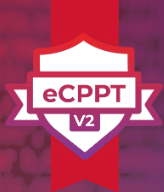

- [Blog](blog.md)
- [Walkthroughs](walkthroughs.md)

---
# Whoami
I'm a cybersecurity professional with over a decade of experience specializing in Application Security and web application penetration testing. I built a scalable AppSec program from the ground up, integrating SAST, DAST, SCA, IAST, and secret scanning tools into the SDLC and CI/CD pipelines to enhance vulnerability detection and remediation across all stages of development and deployment.

My achievements include selecting and implementing the STRIDE threat modeling methodology, curating and deploying tailored training videos for developers, and establishing a Security Champions program to promote a security-focused culture. I also bring experience in risk rating and leveraging data-driven metrics to prioritize security investments and demonstrate the business value of security initiatives, fostering alignment between technical teams and leadership.

I administrate the Cloudflare WAF and have experience working in AWS, GCP, and Azure cloud environments. Additionally, I’ve earned two CVEs and hold eWPT and eCPPT certifications, with plans to further expand my expertise by pursuing HackTricks ARTE certification.

Outside of work, I co-lead the OWASP Cleveland Chapter, sharing knowledge with the security community through workshops and discussions. My background in IT, including Python automation and cloud security, gives me a well-rounded perspective on securing complex systems.

---
# CVEs
- [CVE-2021-38619](https://nvd.nist.gov/vuln/detail/CVE-2021-38619)
  - [CVE Research](https://github.com/charlesbickel/CVE-2021-38619)
- [CVE-2021-38583](https://nvd.nist.gov/vuln/detail/CVE-2021-38583)
  - [CVE Research](https://github.com/charlesbickel/CVE-2021-38583)

---
# Certifications

*2021 - eLearnSecurity Web Application Penetration Tester*

*2021 - eLearnSecurity Certified Professional Penetration Tester*

---
# Memberships & Associations

- Co-lead OWASP Cleveland Chapter
- OWASP Lifetime Member
